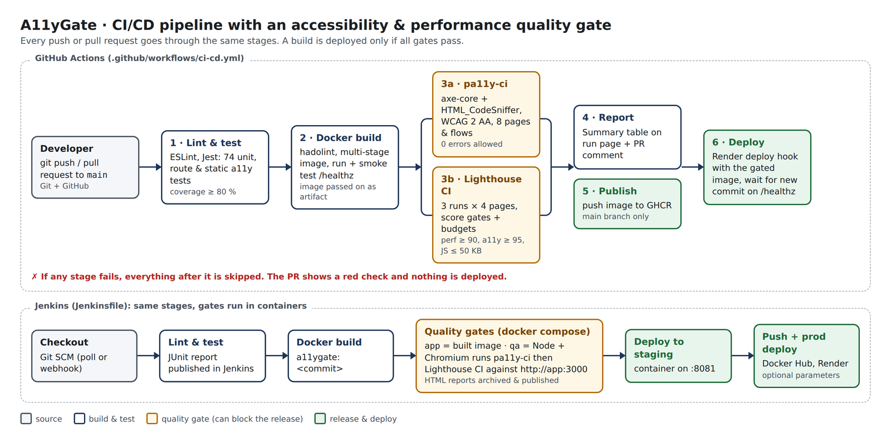
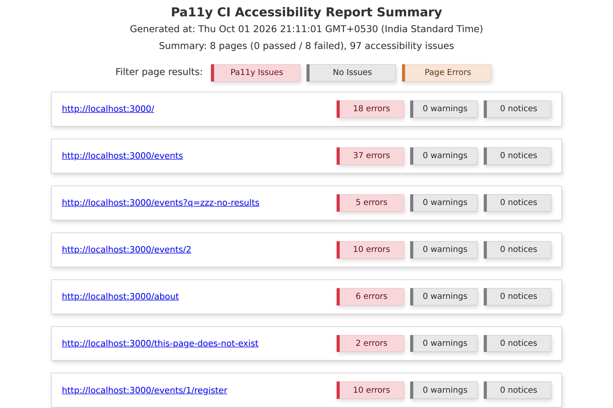
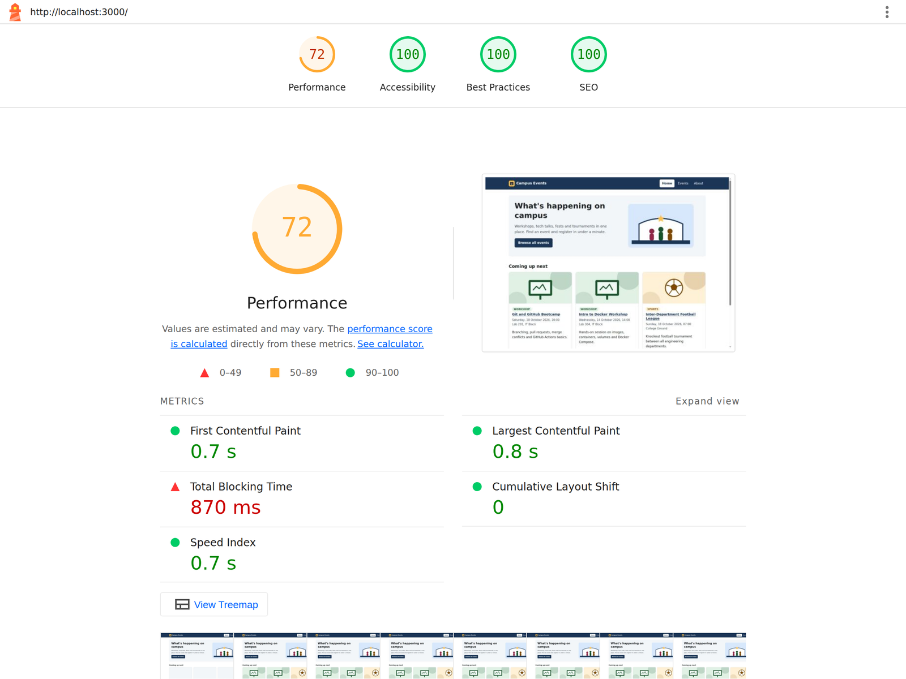

# A11yGate: Accessibility & Performance Quality Gate in a CI/CD Pipeline


**DevOps Lab mini project.** A small but complete web app, *Campus Events*, delivered through a CI/CD pipeline that **refuses to ship a build that is inaccessible or slow**. Every push is linted, unit tested, containerised with Docker, then scanned by three layers of accessibility and performance checks. Only a build that passes all of them is published and deployed.



---

## Why this project

Most pipelines check that code *works*. Very few check that people *can use it*. One in six people worldwide lives with a significant disability, and accessibility bugs (missing alt text, unlabelled inputs, low-contrast text) are cheap to fix before merge and expensive afterwards. Performance regressions behave the same way. This project turns both into automated gates, just like failing unit tests.

## The three-layer quality gate

| Layer | Tool | What it checks | Runs in | Fails the build when |
|---|---|---|---|---|
| 1. Static | Jest + Cheerio (`tests/a11y-static.test.js`) | `lang`, `<title>`, one `<h1>`, heading order, `alt` on every image, `<label>` on every input, link text, skip link | ~1 s, no browser | any check fails |
| 2. Browser scan | **pa11y-ci** with **axe-core + HTML_CodeSniffer** | Full WCAG 2 AA on 8 pages and user flows (search, form error state, 404) | headless Chrome | any WCAG error |
| 3. Lighthouse | **Lighthouse CI** (median of 3 runs) | Category scores and performance budgets | headless Chrome | accessibility < 95, performance < 90, best practices < 90, JS > 50 KB, page > 300 KB, LCP > 2.5 s, TBT > 200 ms, CLS > 0.1 |

Why three layers? Each one catches things the others miss. In testing:
- Removing the search box's `<label>` was **missed by axe-core** (it accepted the placeholder text) but **caught by HTML_CodeSniffer**. That's why pa11y runs two engines.
- Making grey text unreadable (contrast 1.9:1) still left the Lighthouse **accessibility score at 95–96, above the threshold**. Only the per-audit `color-contrast` assertion and pa11y caught it. A score alone is not a sufficient gate.
- The static tests catch missing alt text and labels in about one second, before Docker or a browser is even started.

## Tech stack

| Area | Tools |
|---|---|
| Version control | Git, GitHub (branches, pull requests) |
| Application | Node.js 22, Express 5, EJS templates, Helmet, compression |
| Testing | Jest, Supertest, Cheerio, ESLint, pa11y-ci, Lighthouse CI |
| Containers | Docker (multi-stage, non-root, healthcheck), Docker Compose, hadolint |
| CI/CD | GitHub Actions **and** Jenkins (both included) |
| Registry | GitHub Container Registry (Actions), Docker Hub (Jenkins) |
| Deployment | Render (production), Docker container on port 8081 (Jenkins staging) |

## Project structure

```
a11ygate/
├── src/
│   ├── app.js                 Express app (routes, security headers, compression)
│   ├── server.js              Starts the server, graceful shutdown
│   ├── lib/events.js          Filtering, validation, date formatting
│   └── data/events.json       Sample events
├── views/                     EJS pages (home, events, event + registration form, about, 404)
├── public/                    CSS and SVG images (kept tiny on purpose)
├── tests/
│   ├── events.test.js         Unit tests for business logic
│   ├── app.test.js            HTTP route tests (Supertest)
│   └── a11y-static.test.js    Layer 1 accessibility checks on rendered HTML
├── .pa11yci.js                Layer 2 config (pages, user flows, WCAG 2 AA, reporters)
├── lighthouserc.js            Layer 3 config (score gates and budgets)
├── scripts/
│   ├── summarize-reports.js   Markdown summary for the run page / PR comment / Jenkins
│   ├── run-lhci.js            Runs Lighthouse CI and saves which assertions failed
│   └── demo.js                Breaks / restores the site for the live demo
├── Dockerfile                 Production image
├── Dockerfile.qa              QA runner image (Node + Chromium + pa11y-ci + Lighthouse CI)
├── docker-compose.yml         Run the app locally in Docker
├── docker-compose.ci.yml      App + QA runner (used by Jenkins)
├── .github/workflows/ci-cd.yml  GitHub Actions pipeline
├── Jenkinsfile                Jenkins pipeline
└── jenkins/                   Ready-made Jenkins (Docker CLI, Node 22, plugins)
```

---

## 1. Run it locally

You need **Node.js 22+**, **Git**, **Google Chrome**, and **Docker Desktop** for the container steps.

```bash
git clone https://github.com/neekunjzavar/a11ygate.git
cd a11ygate
npm ci                 # also downloads a Chromium for pa11y (about 150 MB, first time only)
npm run dev            # http://localhost:3000
```

| Command | What it does |
|---|---|
| `npm run lint` | ESLint |
| `npm test` | Jest: 74 unit, route and static accessibility tests, with coverage |
| `npm run gate` | Starts the app, then runs pa11y-ci and Lighthouse CI against it |
| `npm run gate:a11y` / `gate:perf` | One gate only (app must already be running) |
| `npm run gate:summary` | Prints the results table from the latest reports |
| `npm run ci` | Everything above, in order |
| `npm run demo:break-markup` / `demo:break-contrast` / `demo:break-perf` | Introduce a deliberate regression (see Demo script) |
| `npm run demo:reset` | Undo all demo changes |

Reports are written to `reports/`. Open `reports/pa11y/html/index.html` and the `reports/lighthouse/*.report.html` files in a browser.

### In Docker

```bash
docker compose up --build                      # app on http://localhost:3000

# Run the gates fully in containers (what Jenkins does):
docker build -t a11ygate:ci .
docker compose -f docker-compose.ci.yml up --build --abort-on-container-exit --exit-code-from qa
```

## 2. GitHub Actions setup

1. Create an empty GitHub repository and push this project:
   ```bash
   git init -b main && git add . && git commit -m "Initial commit"
   git remote add origin https://github.com/<you>/<repo>.git
   git push -u origin main
   ```
2. Open the **Actions** tab. The pipeline runs on every push and pull request to `main`.
3. Replace `OWNER/REPO` in the badge at the top of this README.
4. *(Recommended)* **Settings → Branches → Add rule** for `main`: require the status checks *3a · Accessibility gate* and *3b · Performance gate* to pass before merging. The gate then really *blocks* bad code.

What you get on each run:
- the stage graph (1 → 2 → 3a ‖ 3b → 4/5 → 6)
- a **Summary** page with the pass/fail table
- downloadable artifacts: test coverage, pa11y HTML report, Lighthouse reports
- on pull requests, a **comment with the results**
- a shareable Lighthouse link (temporary public storage) in the *3b* log

### Deploy to Render (free)

The pipeline deploys the *exact image that passed the gates* from GitHub Container Registry.

1. After the first successful run on `main`, open your GitHub profile → **Packages** → the image → **Package settings** → set visibility to **Public**.
2. In Render: **New → Web Service → Existing image**, image URL `ghcr.io/<you>/<repo>:latest`, instance type *Free*, port `3000`. Create it.
3. In the Render service: **Settings → Deploy Hook** → copy the URL.
4. In GitHub: **Settings → Secrets and variables → Actions**
   - *Secrets* → `RENDER_DEPLOY_HOOK_URL` = the hook URL
   - *Variables* → `PRODUCTION_URL` = `https://<your-service>.onrender.com`
5. Push to `main`. Stage 6 triggers the deploy and waits until `/healthz` reports the new commit.

If the secret isn't set, stage 6 is skipped with a warning and the rest of the pipeline still passes.

## 3. Jenkins setup

A ready-made Jenkins with Docker CLI, Docker Compose, Node.js 22 and all needed plugins:

```bash
cd jenkins
docker compose up -d --build
docker compose exec jenkins cat /var/jenkins_home/secrets/initialAdminPassword
```

1. Open http://localhost:8080, paste the password, choose **Install suggested plugins**, and create an admin user.
2. **New Item → Pipeline** → name `a11ygate`.
3. *Pipeline* section: **Definition: Pipeline script from SCM** → SCM *Git* → your repository URL → branch `*/main` → Script path `Jenkinsfile`.
4. *(Optional)* **Build Triggers → Poll SCM** `H/2 * * * *` so pushes are picked up automatically.
5. **Build Now**. The first run shows the parameter form after it finishes once; later runs use **Build with Parameters**.

Stages: Checkout → Install → Lint & Unit tests (JUnit results) → Docker build → Quality gates (app + QA containers) → Deploy to staging (http://localhost:8081) → Push image *(optional)* → Deploy to production *(optional)*.

The pa11y HTML report appears in the left menu as **Accessibility report (pa11y)**. All reports are under **Build Artifacts**.

Optional credentials (**Manage Jenkins → Credentials**), used only when you tick `PUSH_IMAGE` / `DEPLOY_PROD`:
- `dockerhub-creds`: username + password (or access token) for Docker Hub; also change `DOCKERHUB_REPO` in the Jenkinsfile
- `render-deploy-hook`: *Secret text* with the Render deploy hook URL

---

## 4. Demo script (for the lab evaluation)

About 10 minutes. Have GitHub Actions (or Jenkins) and the live site open before you start.

**Part A: the happy path**
1. Show the app: home → filter events → open an event → submit the form empty (accessible error summary) → register.
2. Show the last green pipeline run: stage graph, Summary table (all 100s), Lighthouse report, Docker image in GHCR, live site on Render.

**Part B: layer 1 catches broken markup in seconds**
```bash
git checkout -b demo/a11y-bug
npm run demo:break-markup      # removes an image's alt text and the search box label
git commit -am "Simplify search box" && git push -u origin demo/a11y-bug
```
Open a pull request. **Stage 1 fails within a minute**: the static tests name the image without `alt` (`/images/hero.svg`) and the input without a label (`q`). Nothing gets built.

**Part B2: layers 2 and 3 catch what unit tests can't see**
```bash
npm run demo:reset
npm run demo:break-contrast    # makes grey text low-contrast (valid HTML, so unit tests pass)
git commit -am "Lighter grey for secondary text" && git push
```
Stages 1 and 2 pass ✅, then **3a and 3b fail** ❌:
- pa11y-ci: **92 errors on 8 pages**, each with the element, the measured ratio (1.9:1 vs 4.5:1 required) and a suggested colour.
- Lighthouse CI: the accessibility *score* is still 95 and would pass on its own, but the `color-contrast` assertion fails. Point this out; it shows why per-audit gates matter.
- The PR comment shows the table and the merge button is blocked.

**Part C: the gate catches a performance regression**
```bash
npm run demo:reset
npm run demo:break-perf        # adds a 700 KB render-blocking "analytics" script
git commit -am "Add analytics" && git push
```
Lighthouse CI fails: performance **72 < 90**, script **528 KB > 50 KB**, TBT **~870 ms > 200 ms**.

**Part D: fix and ship**
```bash
npm run demo:reset && git commit -am "Fix a11y and perf regressions" && git push
```
Pipeline goes green, then merge the PR. Stages 5 and 6 publish and deploy.

| Accessibility bug caught by pa11y-ci | Performance bug caught by Lighthouse CI |
|---|---|
|  |  |

---

## Changing the thresholds

- Accessibility pages and flows: `urls` in `.pa11yci.js`
- Scores and budgets: `assertions` in `lighthouserc.js` (sizes in bytes, times in ms)
- Coverage: `coverageThreshold` in `package.json`

## Troubleshooting

| Problem | Fix |
|---|---|
| `npm ci` hangs downloading Chrome | Set `PUPPETEER_SKIP_DOWNLOAD=true` and `PUPPETEER_EXECUTABLE_PATH` to your Chrome |
| Lighthouse: "Chrome installation not found" | Install Google Chrome, or set `CHROME_PATH` |
| Port 3000 already in use | Stop the other process or run with `PORT=3001` (also set `BASE_URL`) |
| Jenkins: `permission denied ... docker.sock` | Use the provided `jenkins/docker-compose.yml` (runs as root for the lab) |
| Render deploy fails to pull image | Make the GHCR package **public** |
| Lighthouse scores vary a bit run to run | Expected; that's why it takes the median of 3 runs |

## License

MIT
